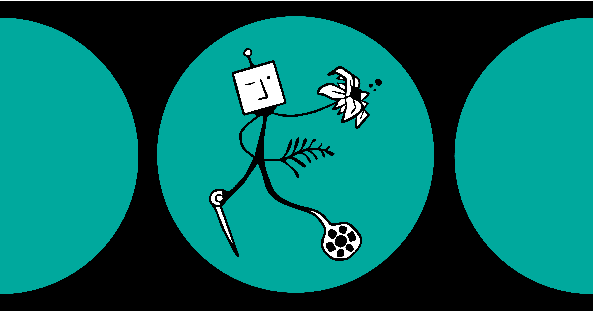

# Max Huber's Portfolio + Blog

Welcome to my personal website! This is a place where I showcase my work, share insights on topics I’m passionate about, and provide updates on various projects I'm working on. Here, you’ll find blog posts, project portfolios, and a range of content spanning AI, game development, spirituality, physics, health sciences, and more.

You can visit the website here: [https://maxhuber.vercel.app](https://maxhuber.vercel.app)

## Features

- **Projects**: A collection of my past and current projects, ranging from AI applications to game development. Each project has a detailed description, tech stack, and links to the repository (where applicable).
  
- **Blog**: Posts covering a wide range of topics, including AI, data science, philosophy, and mindfulness. My goal is to explore both technical and creative subjects.

- **Responsive Design**: The site is fully responsive, ensuring a seamless experience on both desktop and mobile devices.

## Technologies Used

- **Frontend**: Built with [Next.js](https://nextjs.org/) for fast and scalable performance.
- **Markdown**: Blog and project content are managed via markdown files, making it easy to update.
- **Styling**: Tailwind CSS with mobile-first design principles to ensure the site looks great on any screen size.

## Contributing

At this time, the site is not open for public contributions. However, feedback and suggestions are welcome! Feel free to reach out to me via the contact form on the site.

Thanks for visiting, and feel free to explore the site to learn more about my work!
